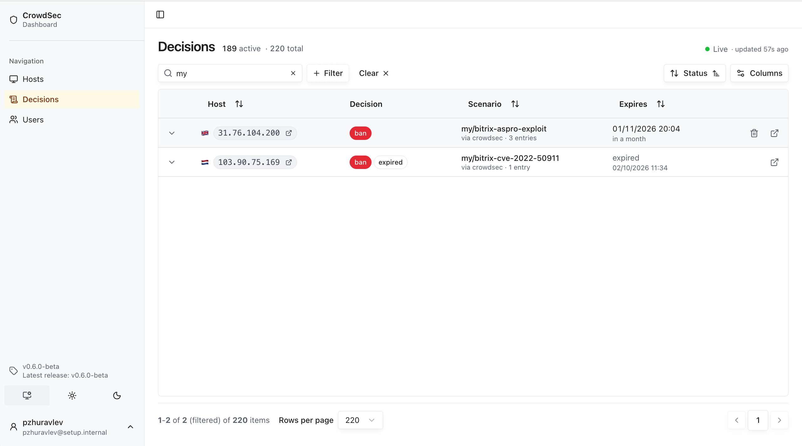

# Сценарии CrowdSec для сайтов на 1С-Битрикс

Набор локальных сценариев CrowdSec для публичных сайтов на «1С-Битрикс: Управление сайтом». Сценарии смотрят access-логи nginx или Apache и поднимают решение на блокировку IP, когда запрос похож на брутфорс админки, разведку ядра или известную атаку.

Каждый файл — отдельный сценарий типа `leaky`. Имя сценария начинается с `my/`, чтобы не пересекаться с хабом CrowdSec.

## Что нужно заранее

- CrowdSec с bouncer, у которого включена ремедиация (`remediation: true` стоит во всех сценариях).
- Коллекция `crowdsecurity/nginx` или `crowdsecurity/apache2`. Фильтры опираются на поля, которые выставляют эти парсеры: `evt.Meta.service`, `evt.Meta.source_ip`, `evt.Parsed.program`, `evt.Parsed.request`, `evt.Parsed.status`.
- Логи, в которых `program` равен `nginx` или `apache2`. Если парсер пишет другое значение, сценарии не сработают.

Сценарии видят только строку запроса из access-лога. Атака, которая целиком сидит в теле POST, сюда не попадает.

## Установка

Скопируйте файлы в каталог локальных сценариев и перечитайте конфигурацию:

```bash
sudo cp bitrix-*.yaml /etc/crowdsec/scenarios/
sudo systemctl reload crowdsec
```

Проверка, что сценарии загрузились:

```bash
sudo cscli scenarios list | grep my/bitrix
```

В логе CrowdSec не должно быть ошибок разбора YAML. После срабатывания решение появляется в `sudo cscli decisions list`.

## AppSec

Правила в `appsec-rules/` проверяют запрос до PHP. Сценарии по access-логу этого не делают: тело POST в лог не попадает, а ответ 200 уже значит, что скрипт отработал.

Сейчас два in-band правила:

- `my/bitrix-esol-kda` режет любой HTTP-запрос к `.php` под `/bitrix/admin/` и `/bitrix/modules/`, если в пути есть `esol` или `kda`. Это cron-скрипты и профили модулей импорта Excel/XML. После такого запрета страница настройки этих модулей в админке тоже не откроется, пока правило включено.
- `my/bitrix-dropped-php` режет запрос к файлу в корне сайта с именем из 8–32 шестнадцатеричных символов и расширением `.php`. Так сканер проверяет, записался ли шелл.

Установка поверх уже работающего AppSec. Строку `crowdsecurity/appsec-default` в `acquis` не убирайте.

```bash
sudo mkdir -p /etc/crowdsec/appsec-rules /etc/crowdsec/appsec-configs
sudo cp appsec-rules/*.yaml /etc/crowdsec/appsec-rules/
sudo cp appsec-configs/bitrix.yaml /etc/crowdsec/appsec-configs/
```

В `/etc/crowdsec/acquis.d/appsec.yaml` добавьте конфиг в конец списка:

```yaml
appsec_configs:
  - crowdsecurity/appsec-default
  - my/bitrix-appsec
```

```bash
sudo systemctl reload crowdsec
sudo cscli appsec-rules list | grep my/bitrix
sudo cscli appsec-configs list | grep my/bitrix
```

`default_remediation: ban` блокирует этот запрос и ставит бан на IP. Адрес, с которого открывают страницу импорта Excel, тоже попадёт в бан. Офис и сервер 1С держите в allowlist.

## Пример

На консоли CrowdSec решения этих сценариев видны по префиксу `my/`. Ниже живой бан по `my/bitrix-aspro-exploit` (три срабатывания, блок на месяц) и уже истёкший бан по `my/bitrix-cve-2022-50911`.



## Сценарии

| Файл | Что ловит |
| --- | --- |
| `bitrix-admin-bruteforce.yaml` | Частые ответы 200 на `/bitrix/admin/index.php` |
| `bitrix-aspro-exploit.yaml` | Запросы к ajax-корзине решений Аспро, через которые гоняют unserialize |
| `bitrix-cve-2020-13484.yaml` | SSRF через `attachUrlPreview` на loopback и частные сети |
| `bitrix-cve-2022-27228.yaml` | Обращение к `/bitrix/tools/vote/import_channels.php` |
| `bitrix-cve-2022-27228-uf.yaml` | CVE-2022-27228: `/bitrix/tools/vote/uf.php` с параметром `attachId` |
| `bitrix-cve-2022-50911.yaml` | Запрос к PHP-командной строке `/bitrix/admin/php_command_line.php` |
| `bitrix-cve-2023-1713.yaml` | Запрос `.htaccess`, `.phtml` или `.phpN` в `/upload/` и `/bitrix/tools/` |
| `bitrix-cve-2023-1713-import.yaml` | CVE-2023-1713 и CVE-2023-1714: ajax импорта и экспорта CRM |
| `bitrix-cve-2023-1720.yaml` | CVE-2023-1720: загрузка через `/desktop_app/file.ajax.php?action=uploadfile` |
| `bitrix-cve-2025-67887.yaml` | Запрос к редактору модуля «Перевод» |
| `bitrix-html-editor-inject.yaml` | Null-byte, `.phar` или `.htaccess` в запросе к `html_editor_action.php` |
| `bitrix-vfs-bypass.yaml` | Обращение к `virtual_file_system.php` в обход запрета каталога `/bitrix/` |
| `bitrix-secret-files.yaml` | Поиск `dbconn.php`, `.settings.php` и `.settings_extra.php` |
| `bitrix-recon-backup.yaml` | `restore.php`, `bitrixsetup.php`, дампы SQL и архивы с датой в имени |
| `bitrix-kernel-scanner.yaml` | Серия 403/404 по `/bitrix/admin`, `tools`, `components`, `php_interface`, `modules` |
| `bitrix-1c-exchange-bruteforce.yaml` | Серия 401/403 на `1c_exchange.php?mode=checkauth` |
| `bitrix-webshell-probe.yaml` | Запрос `sale_print.php` или расширений `.phar`, `.pht`, `.phps` в `/upload/` |
| `bitrix-esol-kda.yaml` | Запрос к `.php` модулей esol/kda в `/bitrix/admin` и `/bitrix/modules` |

Пороги заданы в каждом файле: `capacity` — сколько событий помещается в бакет, `leakspeed` — как быстро бакет пустеет, `blackhole` — на сколько глушится источник после переполнения.

## Ложные срабатывания

- `bitrix-1c-exchange-bruteforce.yaml` считает неуспешный `checkauth`. IP сервера 1С, с которого идёт штатный обмен, лучше добавить в allowlist. Успешный обмен отвечает 200 и этим сценарием не банится.
- `bitrix-cve-2023-1720.yaml` заденет десктоп-клиент Битрикс24, если портал публикует `/desktop_app/`. На обычном сайте «Управление сайтом» этот путь снаружи почти не нужен.
- `bitrix-cve-2023-1713-import.yaml` рассчитан на публичный сайт без внешнего CRM-импорта. Если импорт заказов Instagram или экспорт CRM вызывается снаружи легитимно, сценарий нужно сузить или отключить.
- `bitrix-html-editor-inject.yaml` не банит сам факт открытия визуального редактора. Срабатывает запрос, в котором в строке уже есть `%00`, `.phar` или `.htaccess`.
- `bitrix-kernel-scanner.yaml` смотрит только ответы 403 и 404. Обычная работа админки с кодом 200 сюда не входит. Порог — 10 таких ответов за короткое окно.

Свои адреса и адрес сервера 1С добавьте в allowlist. Тогда LAPI не создаст по ним решение. Команды ниже относятся к CrowdSec 1.6.8 и новее; точный синтаксис смотрите в `cscli allowlists --help`.

```bash
sudo cscli allowlists create trusted --description "Офис и сервер 1С"
sudo cscli allowlists add trusted 203.0.113.10
```

## Чего эти сценарии не закрывают

Часть уязвимостей Битрикс не оставляет устойчивого маркера в access-логе: чтение паролей SMTP и LDAP из админки (CVE-2024-34882 и соседние), XSS в счетах (CVE-2023-1715, CVE-2023-1716), LFI модуля landing под сессией администратора. Их закрывает обновление ядра и модулей, а не фильтр по URL.
